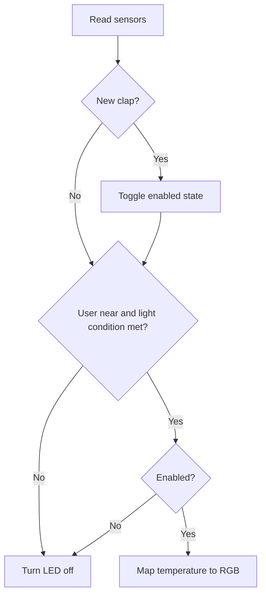

# Smart Lamp

Smart Lamp is an Arduino-based university project that uses proximity, ambient-light, sound, and temperature sensors to control an RGB lamp without physical buttons.

## Goals

- Keep the lamp responsive without blocking delays.
- Make hardware pins, thresholds, and timing easy to configure.
- Prevent a sustained sound from being interpreted as multiple claps.
- Provide serial diagnostics for calibration and debugging.
- Separate future improvements into small, testable milestones.

## Current behaviour

The controller samples four sensors at a fixed interval:

1. The proximity sensor determines whether a user is near the lamp.
2. The light sensor prevents operation outside the configured ambient-light range.
3. A rising sound signal toggles manual lamp enablement, subject to a cooldown.
4. The temperature reading is mapped to an RGB gradient.

The RGB LED turns on only when the environment permits it and clap control is enabled.



## Hardware

- Arduino Uno
- RGB LED
- Analog light sensor
- Analog sound sensor
- Analog temperature sensor
- Digital infrared proximity sensor
- Breadboard, resistors, and jumper wires

### Pin mapping

| Component | Pin | Signal |
| --- | --- | --- |
| Light sensor | `A0` | Analog input |
| Temperature sensor | `A1` | Analog input |
| Sound sensor | `A2` | Analog input |
| Proximity sensor | `D8` | Digital input |
| RGB LED - red | `D9` | PWM output |
| RGB LED - green | `D10` | PWM output |
| RGB LED - blue | `D11` | PWM output |

## Project structure

```text
.
|-- firmware/
|   `-- SmartLampV2/
|       |-- Config.h
|       `-- SmartLampV2.ino
|-- .gitignore
`-- README.md
```

`Config.h` contains the hardware mapping, sensor thresholds, and timing values. `SmartLampV2.ino` contains the runtime behaviour and hardware interaction.

## Getting started

1. Install the [Arduino IDE](https://www.arduino.cc/en/software).
2. Recreate the circuit using the pin mapping above.
3. Open `firmware/SmartLampV2/SmartLampV2.ino`.
4. Select **Arduino Uno** and the correct serial port.
5. Verify and upload the sketch.
6. Open Serial Monitor at **9600 baud** to inspect sensor readings.

## Calibration

The defaults in `Config.h` are starting values based on the original prototype, not universal values. With the lamp connected, observe the Serial Monitor and adjust:

- `MIN_LIGHT_READING_TO_ENABLE`
- `SOUND_THRESHOLD`
- `TEMPERATURE_MIN_RAW`
- `TEMPERATURE_MAX_RAW`
- `PROXIMITY_ACTIVE_LOW`
